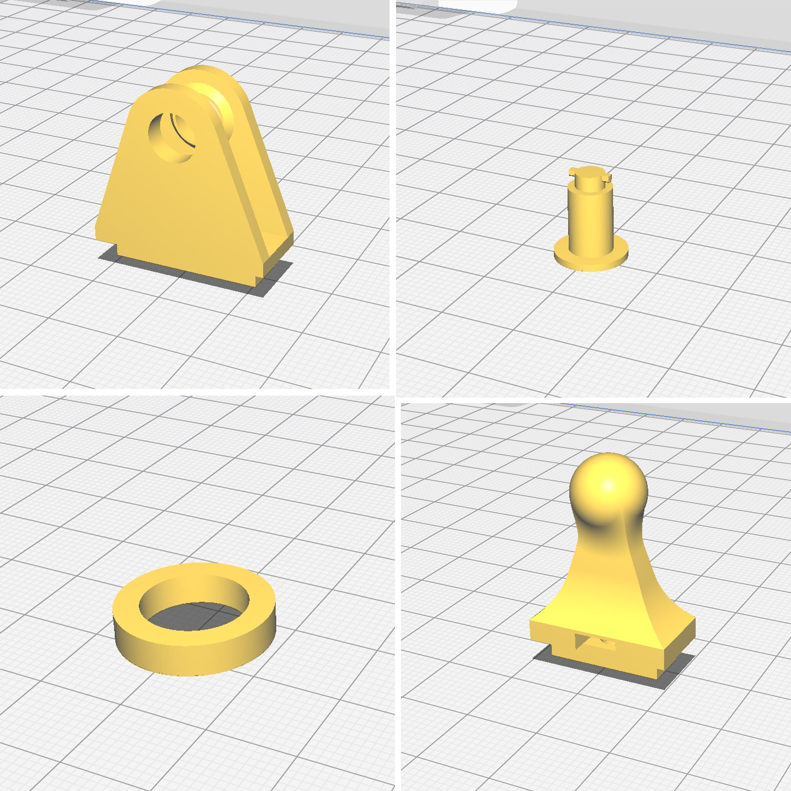

Para a impressão usaremos uma [Ultimaker 2+](https://ultimaker.com/3d-printers/ultimaker-2-plus-connect) com bico de 0,4mm.

 Utilizamos o Ultimaker Cura para gerar os gcodes de nossas peças mas fique a vontade para utilizar o fatiador de sua preferencia.
 
 Recomendamos utilizar *ABS* com as configurações abaixo no seu Fatiador:

``` md 
# Adesão

brim_width = 2              //Dois perimetros de Brim

# Suporte

support_enable = True
support_type = buildplate
support_angle = 80
support_z_distance = 0.25
travel_avoid_supports = True

# Camada & Preenchimento

bottom_layers = 3          // 3 camadas de base
top_layers = 3             // 3 camadas de topo
infill_pattern = grid      // Preenchimento em Grid
infill_sparse_density = 20 // 20% de preenchimento

# Velocidades

skirt_brim_speed =15
speed_infill = 55
speed_layer_0 = 15
speed_print = 70
speed_support = 45
speed_topbottom = 50
speed_travel_layer_0 = 150
```

{: .center style: width='700px'}

Use as imagens acima como guia para posicionar as peças na mesa de impressão do Slicer.


