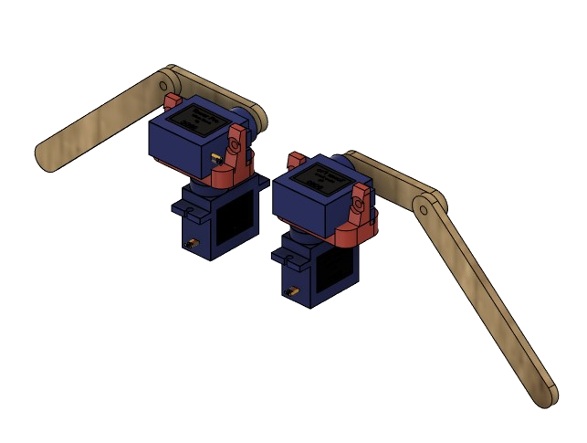
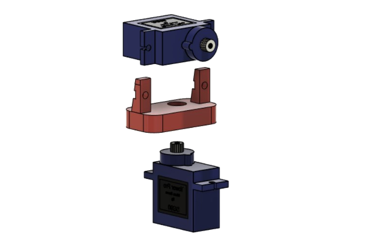
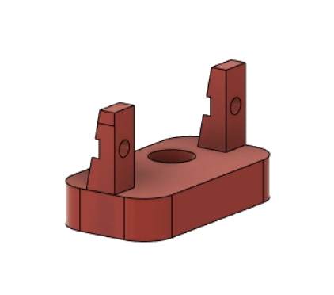

{: .center}

braços do Robozito foram projetados para utilizarem dois pares de Servo Motores 9g, um par de Suportes para os motores e dois pares de braços cortados de MDF de 3mm .

{: .center}

## Motores e Suportes
Utilizamos os Servo motores pela facilidade de controlar sua posição visto que tem encoder dentro do seu corpo e são fortes o suficiente para conseguir levantar o Robozito do chão.

Através da utilização do **Suporte de motor Direito/Esquerdo** impresso em 3D conseguimos realizar a fixação dos motores à 90° formando o que seriam os *ombros*, o que permite que sejam rotacionados os braços assim como baixa-lo e levanta-lo.

{: .center}

<iframe width="560" height="315" class="center" src="https://www.youtube.com/embed/SzHkVUgITJQ" title="YouTube video player" frameborder="0" allow="accelerometer; autoplay; clipboard-write; encrypted-media; gyroscope; picture-in-picture" allowfullscreen></iframe>
