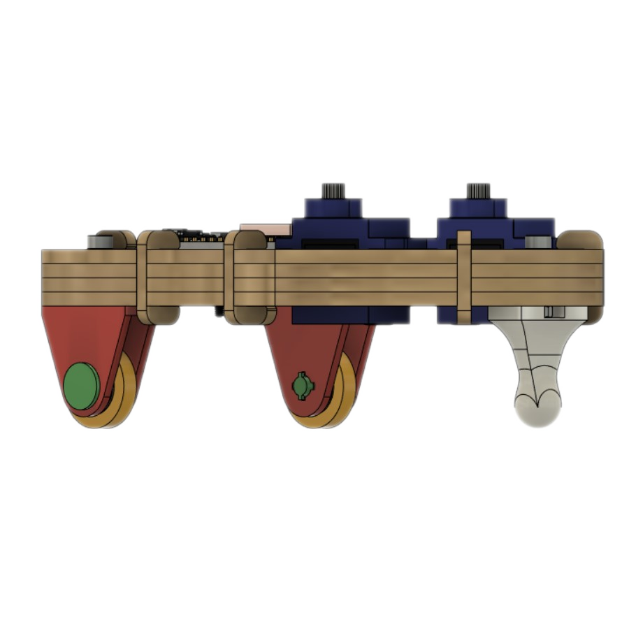
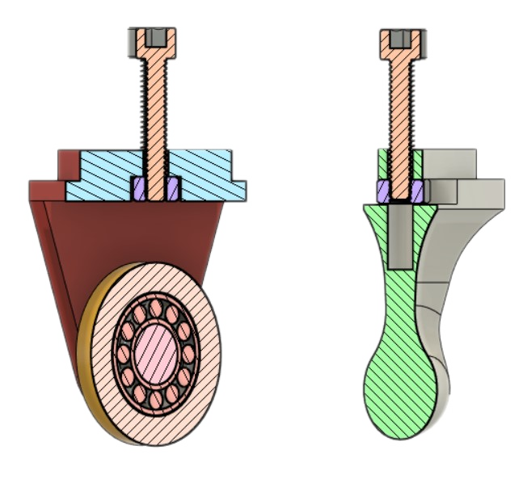

{: .center style="width=300px"}

As rodas e o apoio são montados por baixo do corpo do robozito e fixadas com parafusos M3x16mm e porcas M3, que podemos ver nas imagens.

{: .center style="height=300px"} 

<iframe width="560" height="315" class="center" src="https://www.youtube.com/embed/MyVGw6yiigE" title="YouTube video player" frameborder="0" allow="accelerometer; autoplay; clipboard-write; encrypted-media; gyroscope; picture-in-picture" allowfullscreen></iframe>

## Montagem das rodas

Adicionamos um rolamento **MR126ZZ**  na [**Roda**](files/Roda.stl) e a encaixamos no [**Suporte da Roda**](files/SuporteRoda.stl) antes de inserirmos o [**Eixo da Roda**](files/EixoRoda.stl), após encaixar o eixo podemos colocar a porca no rebaixo interno. ***Recomendo instalar a porca com o robozito de ponta cabeça para que a porca não caia***

## Montagem do apoio frontal

 Para montar o [**apoio frontal**](files/ApoioFrontal.stl) somente precisamos inserir a *porca M3* após remover qualquer material que tenha sobrado da impressão no recesso.

