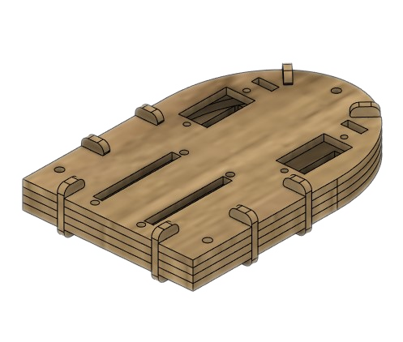
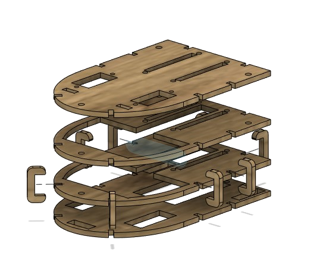

{: .center}
O corpo do Robozito foi idealizado para que seja fácil o acesso aos componentes, assim como mantenha organizados os cabos e conectores no seu interior.

Ele foi pensado para ser cortado na laser utilizando MDF de 3mm empilhado para que chegue na altura necessária para os motores e placas, e preso por clips em forma de "C", o que facilita sua abertura para manutenção.

{: .center}

<iframe width="560" height="315" class="center" src="https://www.youtube.com/embed/T-R1rXtCF9c" title="YouTube video player" frameborder="0" allow="accelerometer; autoplay; clipboard-write; encrypted-media; gyroscope; picture-in-picture" allowfullscreen></iframe>
