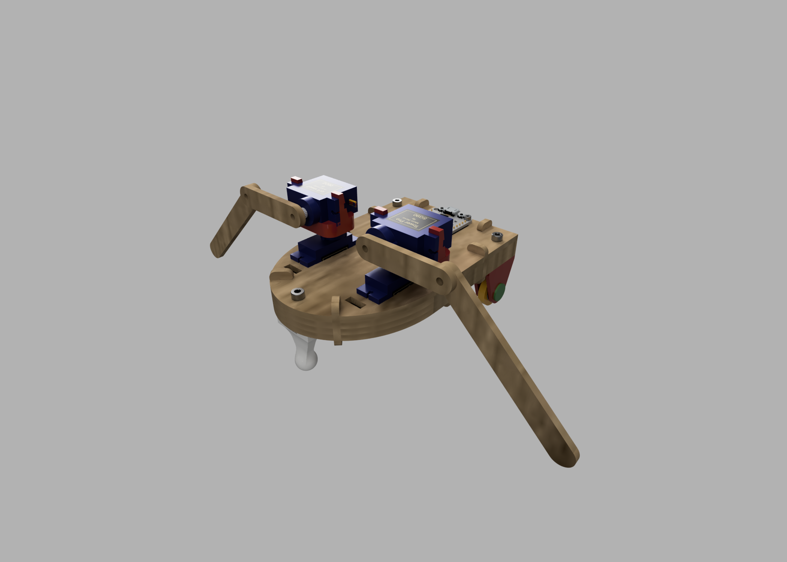
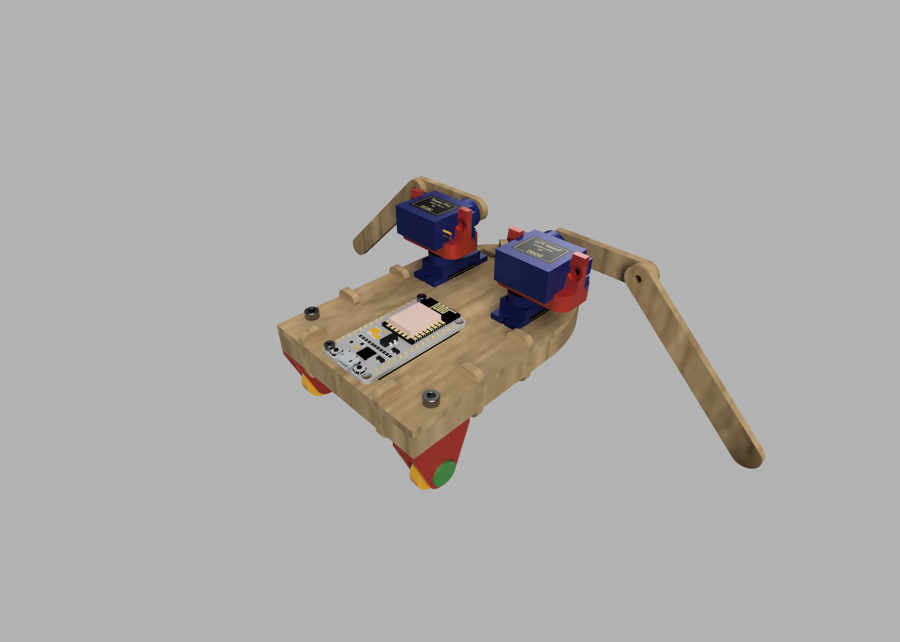

# Robozito 2020

 <iframe title="Robozito Desmontável V25" frameborder="0" allowfullscreen mozallowfullscreen="true" webkitallowfullscreen="true" allow="fullscreen; autoplay; vr" xr-spatial-tracking execution-while-out-of-viewport execution-while-not-rendered web-share width="500" height="500" src="https://sketchfab.com/models/b3e3c40683fd4548993e5b4e39745047/embed?autospin=1&ui_theme=dark"> </iframe> 
 <a href="https://sketchfab.com/3d-models/robozito-desmontavel-v25-b3e3c40683fd4548993e5b4e39745047?utm_medium=embed&utm_campaign=share-popup&utm_content=b3e3c40683fd4548993e5b4e39745047" target="_blank" style="font-weight: bold; color: #1CAAD9;"> Robozito Desmontável V25 </a> by <a href="https://sketchfab.com/LBueno?utm_medium=embed&utm_campaign=share-popup&utm_content=b3e3c40683fd4548993e5b4e39745047" target="_blank" style="font-weight: bold; color: #1CAAD9;"> LBueno </a> on <a href="https://sketchfab.com?utm_medium=embed&utm_campaign=share-popup&utm_content=b3e3c40683fd4548993e5b4e39745047" target="_blank" style="font-weight: bold; color: #1CAAD9;">Sketchfab</a>

O robozito é um projeto que foi criado pelo aluno Wesley Gabriel em conjunto com os técnicos do Insper Fablab para uma atividade da Roadsec 2019 e agora é utilizado como atividade complementar para os alunos de 1o semestre na disciplina de Natureza do Design.

  {: align=left  style="height:400px"}

O robozito apresenta a maioria das suas peças fabricados com máquinas disponíveis em qualquer Fablab, como:

 - Laser: 
    - Corpo
    - Braços
  
 - Impressão 3D:
    - Rodas
    - Suporte dos motores

 - Fresadora de precisão:
    - Placa para conexão com ESP8266
 
 
{: align=right  style="height:400px"}

Seu controle é feito por um ESP8266, que gera uma rede wifi e uma página Web para que os alunos possam conectar e controlalo em conjunto. 
