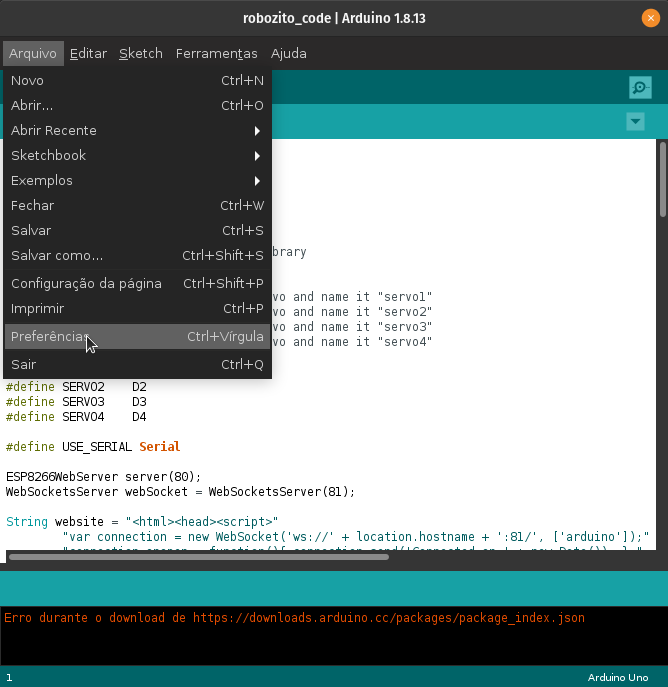
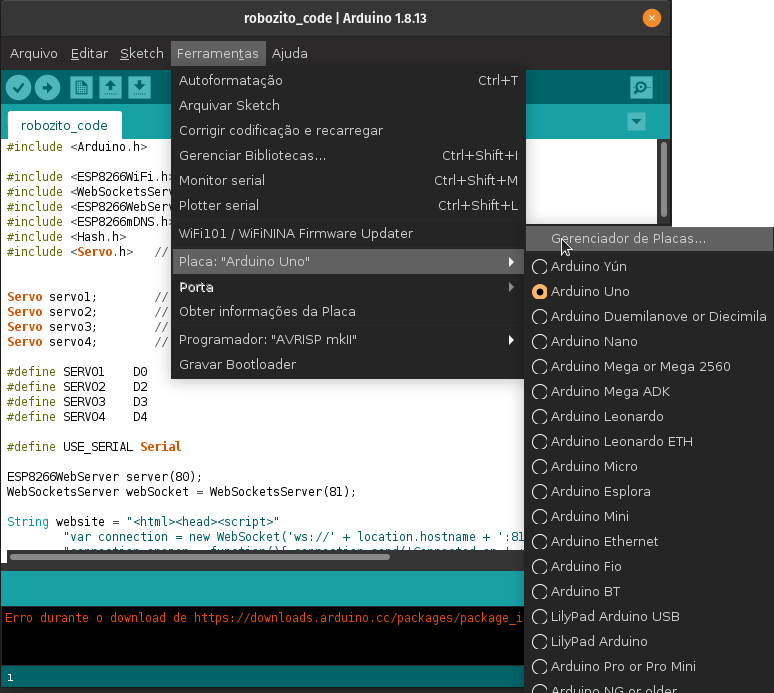
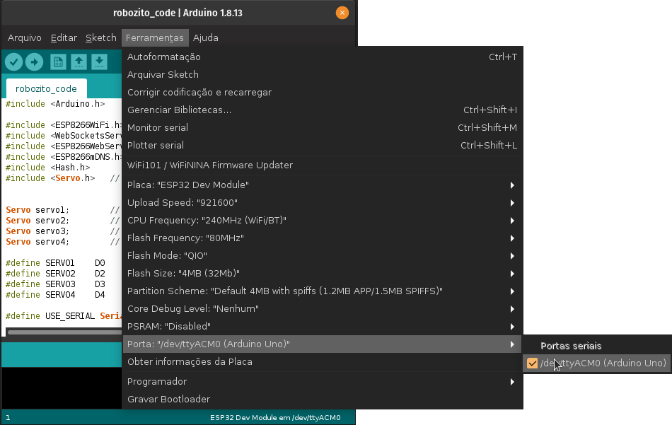
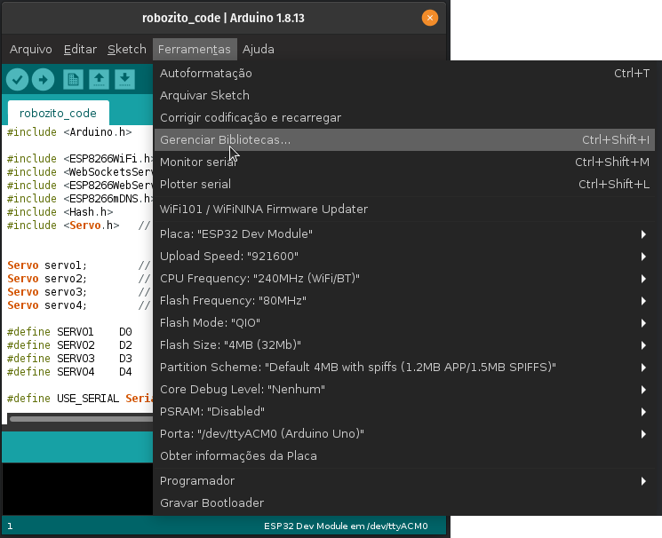

# Download do Arduino IDE

Primeiramente precisaremos baixar o Arduino IDE para que possamos fazer a programacao da placa ESP8266.

Vá à pagina do [Arduino](https://www.arduino.cc/en/software) e selecione o seu sistema operacional para fazer a instalação do sistema corretamente. 

!!! attention "" 
    Por enquanto a versão web do Arduino IDE não suporta o ESP8266

# Instalação do Arduino IDE

Após o download do instalador, prossiga com o processo de instalação normal para seu sistema operacional.

!!! note ""

    === "Windows" 
        
        A diferença entre o arquivo .zip e o .exe é que para rodar o programa à partir do arquivo .zip precisamos abrir a pasta onde foi descompactado e clicar duas vezes no executavel. Para o arquivo .exe o instalador já deve criar atalhos para você no sistema.
        
        === "Arquivo .exe"
            
            Para a instalação utilizando o arquivo .exe só precisamos fazer um click duplo no instalador e seguir o passo a passo das instruções do instalador.
            
        === "Arquivo .zip"

            Para a instalação utilizando o arquivo .zip só precisamos selecionar onde serão extraidos os arquivos, realizar a extração e após finalizado abrir a pasta criada.
            
    === "Linux"    
    
    === "MacOS"
    

# Configurando o Arduino IDE para o Robozito

!!! info "Tutorial baseado no tutorial da [Usinainfo](https://www.usinainfo.com.br/blog/programar-esp32-com-a-ide-arduino-tutorial-completo/)"

## Configurando a IDE para o ESP8266

Para usar e programar ESP32 na IDE do Arduino, precisamos primeiro que ele reconheça os modelos da placa. Para isso, primeiramente devemos ir até as Preferências, **Arquivo** :arrow_right: **Preferências** ou ++ctrl+comma++ , e colar a URL abaixo no campo de URLs adicionais:

http://arduino.esp8266.com/stable/package_esp8266com_index.json

{: .center}

Com isso, permitimos que a IDE acesse uma pequena “base de dados” no formato .json que contém a configuração de inúmeras placas. Após isso, devemos acessar o menu **Ferramentas** :arrow_right: **Placa**  :arrow_right: **Gerenciador de Placas**.

{: .center}

Nele, pesquise por ***esp8266*** na caixa de pesquisa. Em seguida, instale a versão mais recente do driver que irá aparecer: ***esp8266 by ESP8266 Community***, conforme ilustrado na figura a seguir:

{: .center}

Feito isso, você deve selecionar a placa **NodeMCU 0.9 (ESP-12 Module)**, no menu de placas, para programar na ESP.

{: .center}

Por fim, basta você selecionar a porta a qual a ESP está conectada e você estará pronto para enviar códigos para ela!

{: .center}

## Instalando as bibliotecas

{: .center}

Para realizar a instalação das bibliotecas necessárias para nosso código funcionar corretamente devemos ir em **Ferramentas** :arrow_right: **Gerenciador de Bibliotecas**
ou
++ctrl+shift+i++

### As bibliotecas que temos que instalar são:

  - **[ESP8266WiFi.h](https://codeload.github.com/ekstrand/ESP8266wifi/zip/master)**
  - **WebSockets**
  - **PageBuilder** 

Após instaladas as bibliotecas podemos seguir para o [código do Robozito](/Doc_Robozito/programacao/oCodigo)
