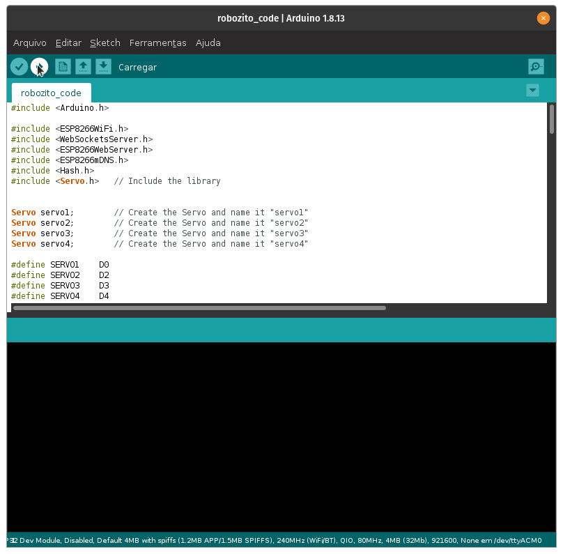

 Após copiar nosso código para a ArduinoIDE e fazer a instalação das bibliotecas necessárias para o funcionamento do nosso código nos resta apenas conectar nossa placa via cabo USB, selecionar a porta em que ele foi plugado como vimos na parte da configuração e clicar no botão **Carregar** na parte superior ou usando o atalho ++ctrl+u++.

{: .center}

Após o carregamento do código já estamos prontos para nos conectar e interagir com o Robozito acessando a rede WiFi gerada pelo ESP8266(com o nome que foi configurado no código) e digitando no navegador o IP ***192.168.4.1***.
Caso não consiga a conexão é possível checar o IP através do monitor serial do ArduinoIDE com baud rate de 115200. para visualizar a informação é necessário resetar a placa com ela conectada no pc e com o monitor serial aberto.
